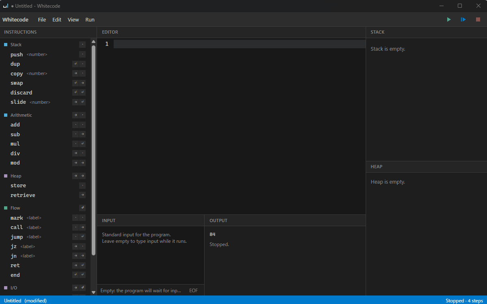
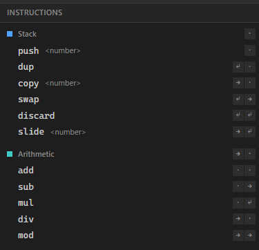
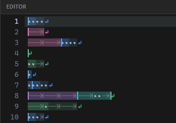
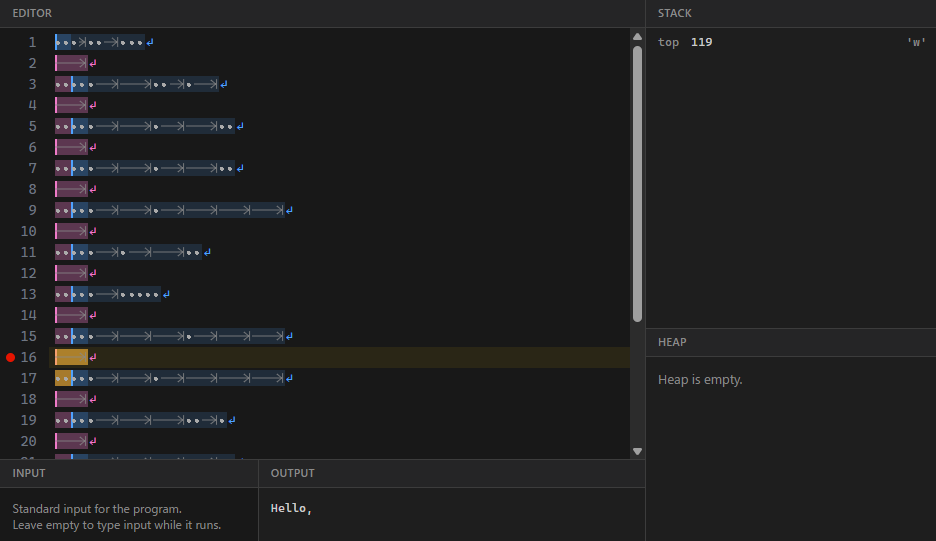

<h1 align="center">
  
  Whitecode
</h1>

Whitecode is a standalone desktop editor for [Whitespace](https://en.wikipedia.org/wiki/Whitespace_(programming_language)), the esoteric programming language whose only meaningful characters are Space, Tab and Linefeed — everything else is a comment.

Writing Whitespace by hand normally means typing invisible characters and hoping you got them right. Whitecode makes the language visible and debuggable instead.

<p align="center">
  
</p>

## Features

- **Instruction palette** — every Whitespace instruction, grouped by category, ready to insert with a click. No need to memorize which sequence of spaces and tabs a command needs.

  
- **Whitespace made visible** — spaces, tabs and line feeds are rendered as visible marks, and each instruction is colored by its category so the structure of a program is visible at a glance.

  
- **Step debugger** — run a program to completion, step through it one instruction at a time, or set breakpoints. Watch the stack, the heap and the current instruction update as the program runs.

  

---

## Building from source

### Prerequisites

- [Node.js](https://nodejs.org/) 26.8.2 or later (a `.node-version` file is provided for [nodenv](https://github.com/nodenv/nodenv) users)
- [pnpm](https://pnpm.io/), enabled via [Corepack](https://nodejs.org/api/corepack.html):
  ```sh
  npm i -g corepack
  corepack enable pnpm
  ```
- Rust and the [Tauri prerequisites](https://tauri.app/start/prerequisites/) for your platform

### Commands

```sh
pnpm install     # install dependencies
pnpm tauri dev   # run in development mode
pnpm tauri build # produce a release build
```

Other useful scripts:

```sh
pnpm test  # run the test suite (Vitest)
pnpm lint  # check formatting and lint rules (Biome)
pnpm fix   # auto-fix formatting and lint issues
```

## License

[MIT](LICENSE)
